**Table of contents**

- [1. Setuping react project](#1-setuping-react-project)
- [2. JavaScript refresher](#2-javascript-refresher)
- [3. React Essentials](#3-react-essentials)
  - [3.1. Components](#31-components)
  - [3.2. index.jsx](#32-indexjsx)
  - [3.3. Built-in vs custom components](#33-built-in-vs-custom-components)
  - [3.4. Dynamic values inside JSX](#34-dynamic-values-inside-jsx)
  - [3.5. Loading images](#35-loading-images)
  - [3.6. Props](#36-props)
  - [3.7. Project Structure](#37-project-structure)
  - [3.8. Component composition - special `children` prop](#38-component-composition---special-children-prop)
  - [3.9. Reacting to events](#39-reacting-to-events)
    - [3.9.1. `onClick` prop](#391-onclick-prop)
  - [3.10. State](#310-state)
  - [3.11. Rendering output conditionally](#311-rendering-output-conditionally)
    - [3.11.1. Using the ternary operator](#3111-using-the-ternary-operator)
    - [3.11.2. Using logical AND (`&&`)](#3112-using-logical-and-)
    - [3.11.3. Using variables](#3113-using-variables)
- [4. React behind the scenes - optimization techniques](#4-react-behind-the-scenes---optimization-techniques)
  - [4.1. How does React update the DOM?](#41-how-does-react-update-the-dom)
  - [4.2. Optimization](#42-optimization)
    - [4.2.1. `React.memo()`](#421-reactmemo)
    - [4.2.2. Avoid component function executions with clever structuring](#422-avoid-component-function-executions-with-clever-structuring)
    - [4.2.3. `useCallback()` hook](#423-usecallback-hook)
    - [4.2.4. `React.useMemo()`](#424-reactusememo)

# 1. Setuping react project

1. Special project setup is needed for react app as we'll be using html in javascript (jsx) 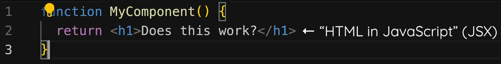 and it does not work in the browser 
2. One option without installing anything is to use webapp by typing `react.new` in browser
3. for local in IDE Vite (pronounced "wit") or create-react-app is needed
4. those tools use node.js so you need to install it
5. steps for creating project in Vite:
   1. type `npm create vite@latest <project_name>`
   2. select a framework - React
   3. select a variant - TypeScript
   4. `npm install`
   5. `npm run dev` - starts a development preview server that allows you to view the web app you're working on (quit it anytime using ctrl+c)

# 2. JavaScript refresher

Normal html with js projects need script tags in html file. In React you will not link them manually as **React projects use a build process**. This means that the code you write is not the code that gets executed (like this) in the browser.
It's React-scripts package (can be seen in package.json) that takes your code and transform it behind the scenes. It one of things is injecting sript tags to html file.
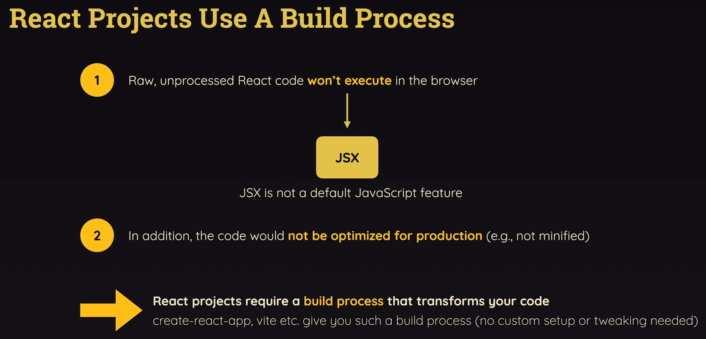

In React during import statements you omit extension of a file (as opposed in raw js where typically '.js' should be added to file name).

To use import and export in js file you would need to add attribute 'type="module"' to script tag in html file, but react's auto-injected script tags do not have them. That's because build process will merge those seperate files you have during development into one big file (or a bunch of big files) imported with old-school syntax in the right order. This is made to make this code execute in browsers that do not support this import-export syntax.

# 3. React Essentials

## 3.1. Components

Reusable building blocks.
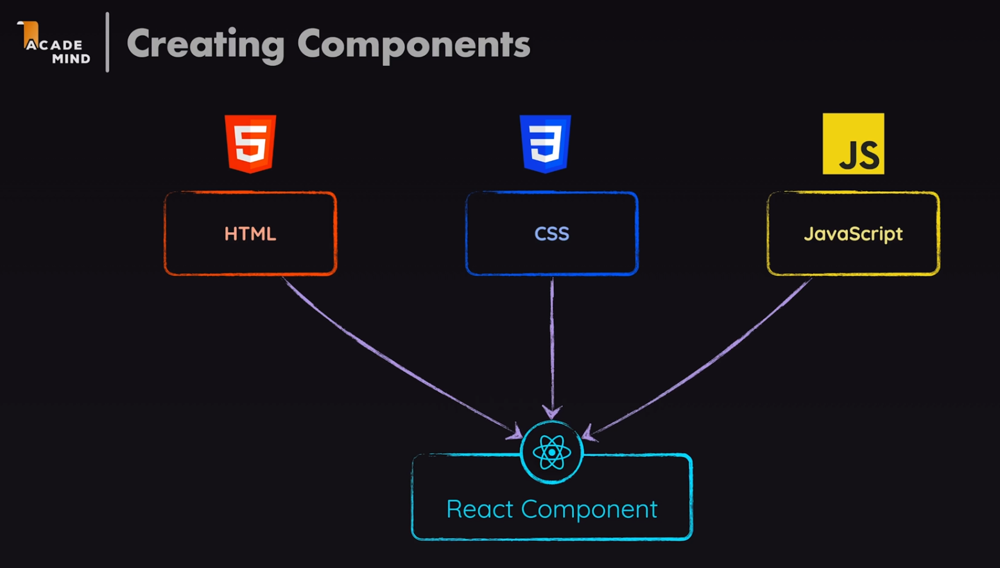
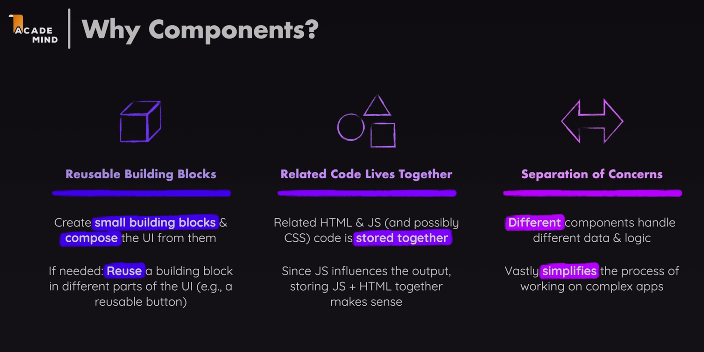


Component is a really just a JavaScript function. But to be recognised as a component by a React it must follow two rules:

1. Name starts with uppercase character
2. It returns a "Renderable" content

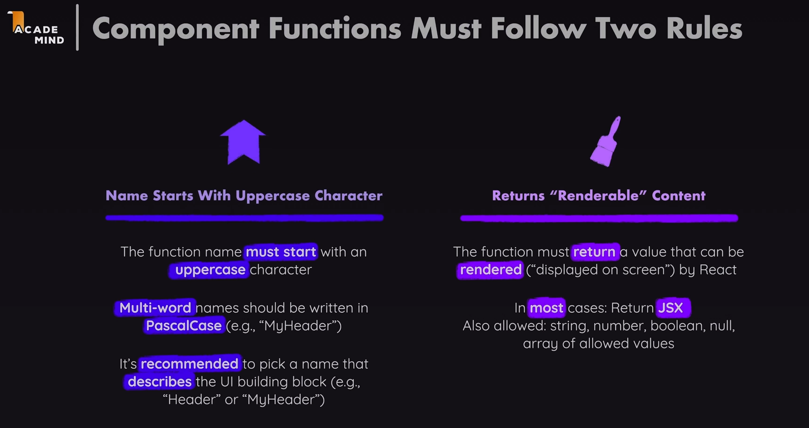

In JS u would use a function `function Header() {}` by executing it `Header()` but that's not how you use components in React. You can use your function as regular HTML element inside JSX code `<Header></Header>`. You could also use self-closing syntax `<Header />`.

## 3.2. index.jsx

_index.jsx_ file acts as a main entry point of React App since it is the first file to be loaded by the HTML file. ReactDOM library (which we import in this file) renders this app component. It is responsible of putting App component contents on the screen. It is rendered by passing jsx code to the `render` method. This `render` method is called on a object that's created by another method (`createRoot` method). `createRoot` method takes existing HTML element as an input (so an element that's not being created by a React, but rather is in _index.html_ file already). So `render` method takes component and renders it inside HTML element.
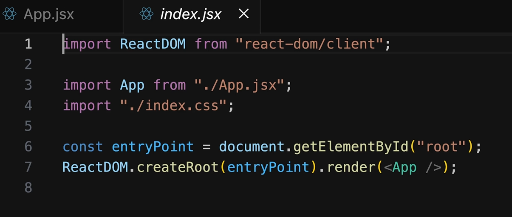
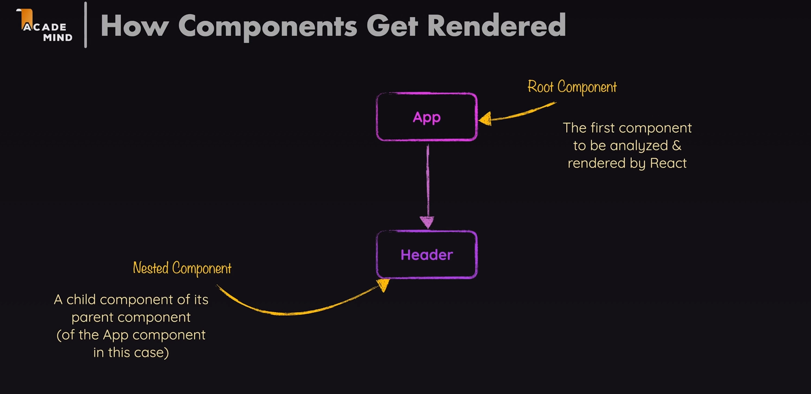
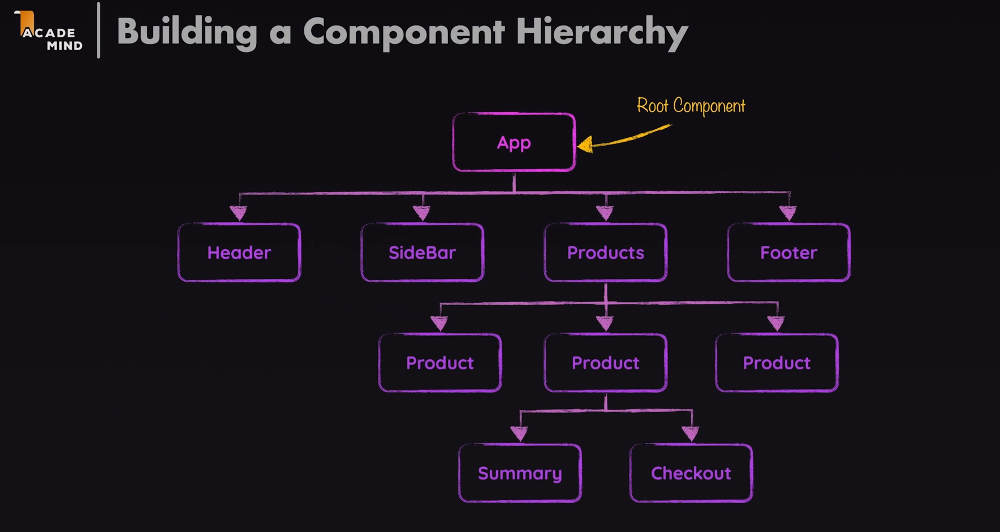

## 3.3. Built-in vs custom components

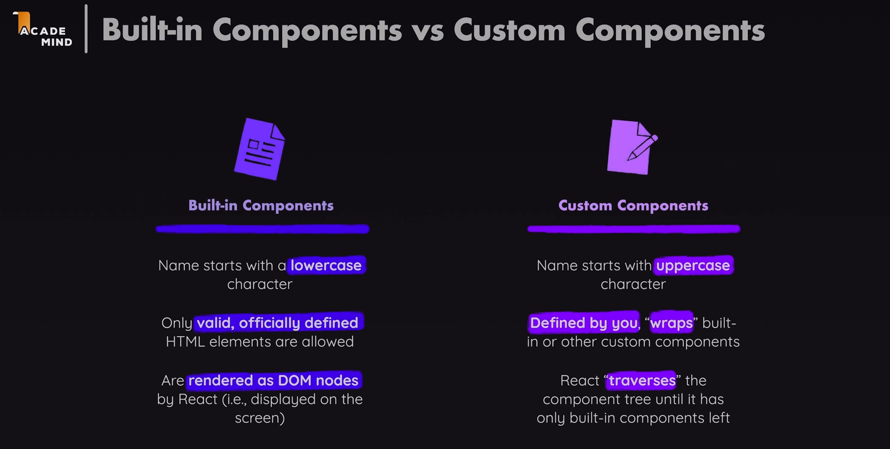

## 3.4. Dynamic values inside JSX

To place a dynamic value in JSX you need to use curly braces `{}`.

## 3.5. Loading images

You shouldnt use standard ``.

Instead you should use import with relative path to this file `import reactImg from './assets/image-name.png'` and then inside JSX ``.

## 3.6. Props

React allows you to pass data to components. via a concept called **props**.
The parameters in function signature of components are what in React is called props. They are called with the value taken from JSX tag attributes, fe:

```html
<CoreConcept
  title="Components"
  description="The core UI building block."
  image="{componentsImg}"
/>
```

```JSX
function CoreConcept(props) {
  return (
    <li>
      
        <h3>props.title</h3>
        <p>props.description</p>
      </img>
    </li>
  );
}
```

## 3.7. Project Structure

Best practice is to store one component per file. Those files are usually stored in a _components_ subfolder of _src_ folder. The convention is to name those files the same name as the component name that will be stored in that file. Most of the time exporting is done using `default` keyword.

Css files related to components should have the same name as the component file and put in the same folder. They are then imported in a related component file.

Be careful as those styles in css file are **NOT** scoped only to this component. Splitting the css code into the component specific css files can still make sense since it makes it easy to see which style SHOULD relate to which component, making adjusting those styles easier.
(There is a solotion to this potential problem. Later in course.)

There is an option to create a folder for each group of files related to component, named the same as component file. This is not required and comes down to personal preference.

## 3.8. Component composition - special `children` prop

React by default ignores input between opening and closing component tags. To use something like `<TabButton>Components</TabButton>` you need to add parameter (usually called props) to a component function signature as usual. There is a special built-in children prop (`props.children`). This children prop simply refers to the content between component tags.

## 3.9. Reacting to events

In vanilla JS to react to event for a button click you would do something like this `document.querySelector('button').addEventListener('click', () => {})`.

In a React project we don't want to write imperative code like this, instead we want to write declarative code. You can do that by adding special attribute (special prop) to elements.

There are many special props which name starts with `on`. Their value is always a funcion.

The function name convention for special prop is to use _handle_ + _name of the event_ (e.g.: `handleClick`). Another common option is to call it _name of the event_ + _Handler_ (e.g.: `clickHandler`)

### 3.9.1. `onClick` prop

```jsx
export default function TabButton({ children }) {
  function handleClick() {
    console.log("Hello World!");
  }

  return (
    <li>
      <button onClick={handleClick}>{children}</button>
    </li>
  );
}
```

## 3.10. State

By default React component funtions execute only once. So if there is a change in displayed content there is a way to tell react to execute component function again.

State is all about registering variables that are handled by React and are updated with the help of a function that's provided by React, that will also tell React that data changed, that will therefore cause React to update the UI.

Those special variables are created with the help of the special function that must be imported from React library.

```jsx
import { useState } from "react";
```

This are so called React hook. All these funtions that start with 'use' in React projectsare React hooks. Special thing about React hooks is that they are technically regular functions, but they must ONLY be called inside of React component functions, or inside of other React hooks (e.g. custom React hooks).

You must call those hook functions directly inside of the component functions, not nested inside some other code (e.g. not nested inside of inner function of component function). It must be called on the top level of component function.

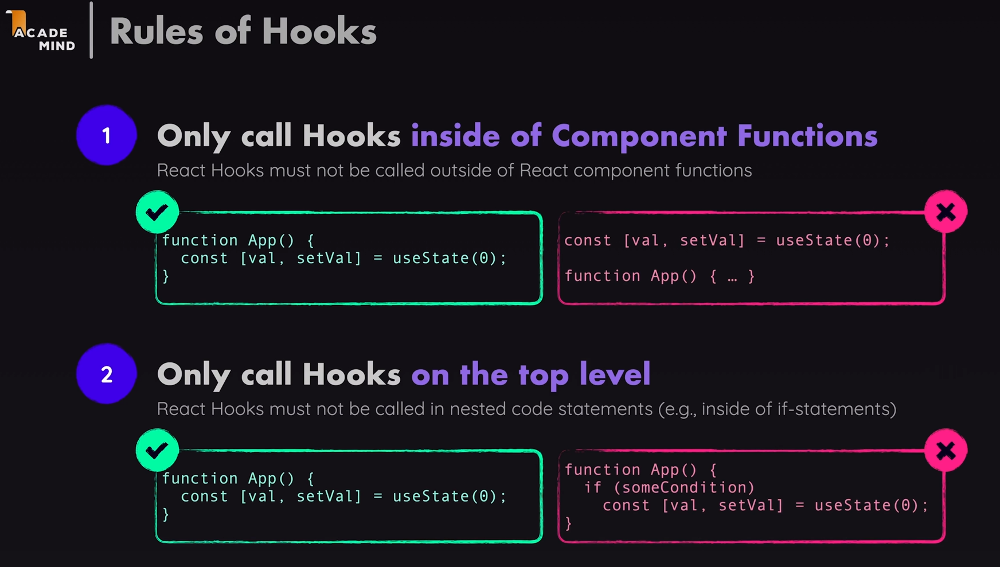

`useState` is one of the most important hooks offered by React, because that's the hook that will allow us to manage component specific state, which is simply some data stored by React, which when changed will trigger this component function, to which this hook belongs, to re-execute.

`useState` accept an argument which is default value React will store and use the first time component is rendered. `useState` also returns a value which can be stored in variable or constant (it doesnt matter). This value is an array which has exactly 2 elements. Commonly it is received using array destructuring to store these 2 elements in 2 seperate constants. Common naming convention is to use something like:

```jsx
const [selectedTopic, setSelectedTopic] = useState("Please click a button");
```

First element in returned array from setState is the current data snapshot for this component execution cycle. So for first execution of component function it will be this initial value. If it's executed again for some reason it will be the updated value.

The second element will always be a function. A function provided by React that can be executed to update this state (this stored value). ut in addition to updating this stored value, calling this special function will also tell React that component function must be executed again.

We can use const here because value stored as state will be recreated everytime this component function executes. But behind the scenes React will update the actual value that will be passed on to this constant when this component function executes again.

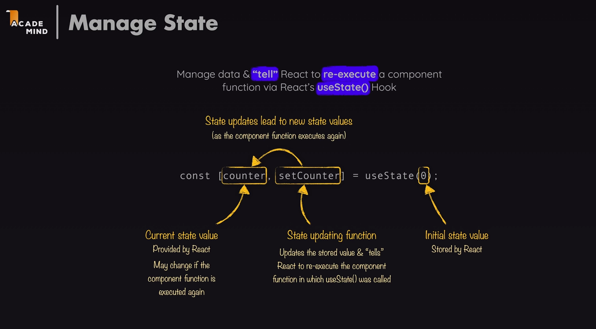

**Two rules of hooks**:

- only call hooks at the top level
- only call hooks from react funtions (component functions or custom hooks)

**Derived state**:

- If you can calculate something from existing data during render, you should NOT put it in state.

## 3.11. Rendering output conditionally

### 3.11.1. Using the ternary operator

You can putt null in JSX code then nothing will be rendered. Useful in ternary operators inside JSX code.

```jsx
{
  !selectedTopic ? <p>Please select a topic.</p> : null;
}
```

### 3.11.2. Using logical AND (`&&`)

or using `&&`

```jsx
{
  !selectedTopic && <p>Please select a topic.</p>;
}
```

### 3.11.3. Using variables

or store it in variable

```jsx
// inside component function
let tabContent = <p>Please select a topic.</p>;

if (selectedTopic) {
  tabContent = (
    <div id="tab-content">
      <h3>{EXAMPLES[selectedTopic].title}</h3>
      <p>{EXAMPLES[selectedTopic].description}</p>
      <pre>
        <code>{EXAMPLES[selectedTopic].code}</code>
      </pre>
    </div>
  );
}

return { tabContent };
```

# 4. React behind the scenes - optimization techniques

## 4.1. How does React update the DOM?

It updates from top to bottom of the tree. The App component is usally the top component. If any custom component is in renderable JSX part of it then it will render (execute component function) of this component as well and so on.

## 4.2. Optimization

### 4.2.1. `React.memo()`

To prevent unnecessary renders triggered by a parent component you can use `memo` function. Just wrap your component function as argument to memo function imported from React. To work in all cases Sonar would advise that instead of exporting directly this memo it is better to store it as a const (preferably with the same name as the component) first and then export this const.

This `memo` function prevents triggering component function if props are the same. It does not care about internal state though and will not prevent rerendering if state changes (`useState`).

**Don't overuse `memo()`**.

It might be tempting to wrap all your component functions in memo. But you should **NOT** do that. Checking props with `memo()` costs performance. If you wrap it around all your components it will add a lot of unnecessary checks.

Instead, **use it as high up in the component tree as possible**. Blocking a component execution there also block all child component executions.

### 4.2.2. Avoid component function executions with clever structuring

State changes and reexecutions of child components do **NOT** trigger parent component executions. Knowing that, moving state as low in the tree as possible is preferred.

### 4.2.3. `useCallback()` hook

In general, `useCallback` is a wrapper around an existing function. It is primarily used together with `React.memo`.

A common example is when you pass an `onClick` handler from a parent component to a child component. Even if the function's code stays the same, a new function is created every time the parent component re-renders. Because of that, `React.memo` treats it as a different prop and re-renders the child component.

To avoid this, we can let React manage the function's lifecycle by wrapping it in `useCallback()`. The hook returns a memoized version of the function, and it is common to store it in a `const` with the same name as the original function.

`useCallback` takes two arguments:

1. The function to memoize.
2. An array of dependencies.

As long as none of the dependencies change, `useCallback` returns the same function instance on every render. This allows `React.memo` to see that the prop has not changed and avoid unnecessary re-renders.

### 4.2.4. `React.useMemo()`

Just as you want to prevent component functions with `memo`, you also may want to prevent execution of normal functions that are called inside component functions, unless their import changed. React gives us `useMemo` hook.

- `memo` - wrapped around component functions
- `useMemo` - wrapped around normal functions inside component funcitons

`useMemo` takes two arguments:

1. A function that returns the value you want to memoize.
2. An array of dependencies.

```jsx
const sortedUsers = useMemo(() => {
  return users.sort((a, b) => a.name.localeCompare(b.name));
}, [users]);
```

In the example above, the sorting operation will only run again when `users` changes. On every other render, React returns the previously computed value.

This can be useful when:

- Performing expensive calculations.
- Filtering or sorting large arrays.
- Creating derived data from props or state.
- Returning objects or arrays that are passed to memoized child components.

For example:

```jsx
const filteredUsers = useMemo(() => {
  return users.filter((user) => user.active);
}, [users]);
```

Without `useMemo`, the filter operation would run on every render, even if `users` had not changed.

However, `useMemo` should **NOT** be used everywhere. Memoization also has a cost because React needs to store the previous value and compare dependencies on every render. For cheap calculations, `useMemo` can actually make your code more complicated without providing any performance benefit.
